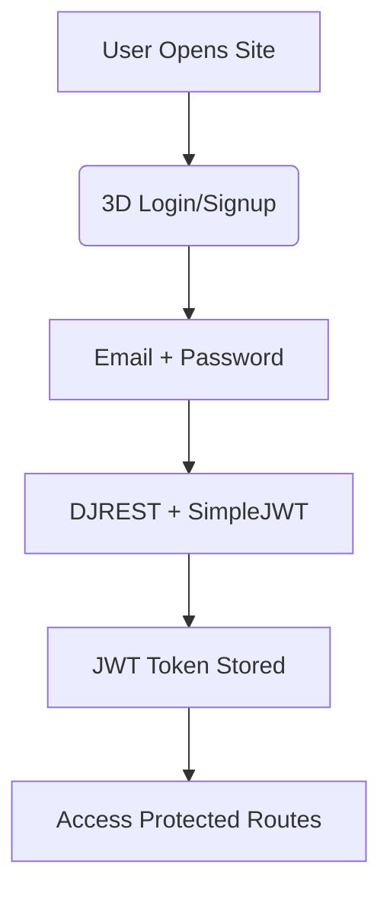

 
#  **Sayyed Rabeeh's Full-Stack  Interactive Portfolio**  
  | [Frontend Repo](https://github.com/sayyedrabeeh/portfolio/tree/main/Frontend) | [Backend Repo](https://github.com/sayyedrabeeh/portfolio/tree/main/Backend)

> **A next-gen, immersive, full-stack portfolio** featuring **3D animations**, **physics-based interactions**, **real-time social features**,  — built with **React + Django + PostgreSQL**.

---

##  **Overview**

This is **not just a portfolio** — it's a **digital experience**.  
From a **3D animated login/signup** with **Framer Motion**, to a **physics-driven skills section** using **Matter.js**, a **dynamic journey timeline**, and a **social media-style project showcase** with **likes, comments, categories, and saves** — this project redefines personal branding.

Fully **backend-powered**, **JWT-authenticated**, and **admin-managed**, it allows seamless content updates, user engagement, and AI-enhanced features.

---

## 🎨 **Live Preview (Screenshots)**

## Live Preview (Screenshots)

| **3D Login Page** | **Physics Skills Section** |
|-------------------|----------------------------|
|  |  |

| **Project Card** | **Project Explore View** |
|------------------|--------------------------|
|  |  |
---

##  **Key Features**

| Feature | Description |
|-------|-----------|
| **3D Login/Signup** | Stunning 3D scene with **Framer Motion**, **Three.js**  |
| **Interactive Skills** | Physics-based skill orbs using **Matter.js** — drag, collide, explore |
| **Animated Journey Timeline** | Smooth cureved timeline with **react-curved-timeline-component**   |
| **Bike Animation Control** | Interactive bike that **starts/stops** on scroll — pick timeline cards |
| **Social Project Feed** | Like ❤️, Comment 💬, Save 🔖, Category Filter — like Instagram |
| **Admin Dashboard** | Add/edit **projects**, **journey cards**  |
| **JWT Authentication** | Secure login/signup with **Django REST + SimpleJWT** |
| **Email.js Integration** | Contact form with **instant email delivery** and AutoReply |
| **AI-Powered Responses** | Auto-responses via **OpenRouter (Mistral API)** |
 

---

##  **Tech Stack**

### **Frontend**
```bash
React  | Vite  | Three.js  | Framer Motion | 
Tailwind CSS | Matter.js | Swiper.js |  Lucide Icons | React Router

### **Backend**
```bash
Django  | Django REST Framework | PostgreSQL 
JWT Auth | Django CORS | Whitenoise | Psycopg2
```

### **Key Libraries**

| Category | Libraries |
|--------|---------|
| **3D & Animation** | `@react-three/fiber`, `@react-three/drei`, `three`, `framer-motion`, `gsap`  |
| **Physics** | `matter-js` |
| **UI/UX** | `tailwindcss`, `lucide-react`, `swiper`, `react-parallax-tilt`, `lottie-react` |
| **State & Utils** | `axios`, `date-fns`, `react-toastify`, `maath`, `moment` |
| **Async & Background** | `celery`, `redis`, `django-celery-beat` |
| **AI & External** | `openrouter`, `mistral api`, `@emailjs/browser`, `gTTS` |

---

## **Project Structure**

```bash
portfolio/
├── Frontend/
│   ├── src/
│   │   ├── components/       # 3DLogin, SkillsPhysics, Timeline, ProjectCard, etc.
│   │   ├── pages/            # Home, Projects, Admin, etc.
│   │   ├── App.jsx           # Main router
│   │   └── main.jsx
│   └── vite.config.js
│
├── Backend/
│   ├── myportfolio/
│   │   ├── views.py          # API endpoints
│   │   ├── models.py         # Project, Journey, Skill, Comment, User
│   │   ├── serializers.py
│   │   └── urls.py
│   ├── celery.py
│   └── settings.py
│
└── README.md
```

---

## **Authentication Flow**



---

## **Interactive Features Deep Dive**

### **3D Login with Framer Motion + Three.js**
- Floating 3D blob with **drawable texture**
- Animated background gradient: **blue to black**
- Smooth page transitions

### **Physics Skills Section (Matter.js)**
```js
// Drag, drop, collide skill nodes
Engine, World, Bodies, Runner
```

### **Curved Journey Timeline**
- Scroll to **start/stop bike animation**
- Click timeline card to **pause and highlight**

### **Social Project Cards**
```js
interface Project {
  id, title, desc, image, likes[], comments[], category, savedBy[]
}
```
- Real-time **like/comment** via API
- **Save to profile**

---

## **Setup & Installation**

### **Prerequisites**
- Node.js ≥ 18
- Python ≥ 3.11
- PostgreSQL
- Redis Server

---

### **1. Clone the Repository**
```bash
git clone https://github.com/sayyedrabeeh/portfolio.git
cd portfolio
```

---

### **2. Backend Setup**

```bash
cd Backend
python -m venv venv
source venv/bin/activate  # Linux/Mac
# venv\Scripts\activate   # Windows

pip install -r requirements.txt
```

#### Create `.env` in `Backend/`
```env
DEBUG=True
SECRET_KEY=your-secret-key
DB_NAME=portfolio_db
DB_USER=postgres
DB_PASSWORD=yourpassword
DB_HOST=localhost
DB_PORT=5432
REDIS_URL=redis://localhost:6379/1
EMAILJS_SERVICE_ID=your_service_id
EMAILJS_TEMPLATE_ID=your_template_id
EMAILJS_USER_ID=your_user_id
OPENROUTER_API_KEY=sk-or-xxx
```

#### Migrate & Run
```bash
python manage.py migrate
python manage.py createsuperuser
python manage.py runserver
```

 

---

### **3. Frontend Setup**

```bash
cd ../Frontend
npm install
```

#### Create `.env` in `Frontend/`
```env
VITE_API_BASE=http://localhost:8000/api
VITE_EMAILJS_SERVICE_ID=your_service_id
VITE_EMAILJS_TEMPLATE_ID=your_template_id
VITE_EMAILJS_PUBLIC_KEY=your_public_key
```

#### Run Dev Server
```bash
npm run dev
```

---

## **API Endpoints** (`/api/`)

| Method | Endpoint | Auth | Description |
|-------|--------|------|-----------|
| POST | `/auth/login/` | No | JWT Login |
| POST | `/auth/register/` | No | Register User |
| GET | `/projects/` | No | List Projects |
| POST | `/projects/{id}/like/` | Yes | Like Project |
| POST | `/projects/{id}/comment/` | Yes | Add Comment |
| POST | `/admin/projects/` | Yes (Admin) | Create Project |
| PUT | `/admin/journey/` | Yes (Admin) | Update Timeline |

---

## **Admin Panel**

 

- Add **Projects**, **Journey Cards**, **Skills**
- Manage **User Comments**, **Categories**
- View **Analytics**

---

## **AI Features (OpenRouter + Mistral)**

 - for sayyed rabeeh's bot fallback reply

---

## **Design & Animation**

- **Tailwind CSS** with custom animations
- **Dark mode** with gradient shifts
- **Parallax**, **tilt effects**, **particle backgrounds**
- **Lottie animations** on load

---
 
 

## **Author**

**Sayyed Rabeeh**  
Full-Stack Developer  

[](https://github.com/sayyedrabeeh)  
[](#)

---

> **"Code is poetry. Animation is emotion. This portfolio is both."**  
> — *Sayyed Rabeeh*

---
 
 

 
 
