<div align="center">

### **⭐ If this inspires you, consider giving it a star! ⭐**

**Built with 💙 by Sayyed Rabeeh**

*"Code is poetry. Animation is emotion. This portfolio is both."*

</div>


#  **Sayyed Rabeeh's Fullstack Portfolio**
### *Where Skills Come Alive Through Code*

[](https://portfolio-fronted-static.onrender.com/)
[](https://github.com/sayyedrabeeh/portfolio)

> **"It's not just a static portfolio — it's an interactive, social, and AI-powered experience where visitors can explore my projects, comment, engage, and actually feel my skills in action through 3D visuals and physics-based interactions."**

---

 

## Live Preview (Screenshots)

| **3D Login Page** | **Physics Skills Section** |
|-------------------|----------------------------|
|  |  |

| **Project Card** | **Project Explore View** |
|------------------|--------------------------|
|  |  |

---
 
##  **Overview**

This portfolio is not your typical static showcase. It's a **full-stack, production-ready web application** that transforms the traditional portfolio experience into an **interactive social platform**. Built over 4-5 months (with one month of intensive development), this project demonstrates advanced full-stack capabilities through immersive 3D animations, real-time physics simulations, social engagement features, and AI-powered interactions.

### **What Makes It Different?**

While most portfolios are beautiful but passive experiences where visitors simply scroll and leave, this portfolio invites users to:
- **Engage** with projects through comments and reactions
- **Experience** skills through interactive 3D and physics-based visualizations
- **Explore** a dynamic journey timeline that represents growth as an adventure
- **Interact** with AI-powered response systems
- **Connect** in a community-driven environment

---

##  **The Problem & Vision**

### **The Problem with Traditional Portfolios**

Traditional portfolios suffer from a fundamental flaw: **they're one-way communication channels**. Visitors arrive, scroll through projects, perhaps click a few links, and then leave. There's no:
- Feedback loop for the developer
- Engagement mechanism for visitors
- Reason to return or spend time exploring
- Demonstration of interactive development skills
- Community or social element

### **The Vision**

I wanted to solve this by creating a portfolio that:

1. **Transforms passive viewing into active participation** - Visitors can comment, like, and save projects
2. **Demonstrates technical depth immediately** - 3D login, physics simulations, and smooth animations showcase skills before a single project is viewed
3. **Creates a feedback ecosystem** - Real user opinions help me improve while showing recruiters genuine community engagement
4. **Appeals to everyone** - Recruiters evaluate skills, clients see capabilities, developers can collaborate and interact
5. **Stands out in a sea of similarity** - In an era where thousands of developers have portfolios, this one feels alive

### **Inspiration**

After seeing countless visually impressive but interaction-lacking portfolios, I asked: **"Why not make something more dynamic and human?"** The inspiration came from realizing that modern web development is all about interactivity and user experience — so why shouldn't a developer's portfolio embody those same principles?

---

##  **Key Features**

### **Immersive User Experience**

| Feature | Description | Technical Highlight |
|---------|-------------|---------------------|
| **3D Login Portal** | Stunning 3D scene with drawable textures and animated gradients | Three.js + Framer Motion integration |
| **Physics Skills** | Interactive skill orbs with real physics — drag, collide, explore | Matter.js engine in React |
| **Journey Timeline** | Animated bike traveling along curved path representing growth | Custom component with scroll-based controls |
| **Dark Futuristic Theme** | Smooth gradient animation between blacks, purples, and blues | Cinema-quality aesthetic |

### **Social Engagement System**

- **Like & Save** - Instagram-style reactions to projects
- **Real-time Comments** - Instant feedback without page reloads
- **User Authentication** - JWT-based secure login for visitors
- **Category Filtering** - Explore projects by technology or type
- **Personal Collections** - Save favorite projects to profile

### **AI-Powered Intelligence**

A **three-layered response system** ensures visitors always get meaningful answers:

1. **Predefined Logic** - Custom conditions for common questions (greetings, tech stack, project details)
2. **AI Fallback** - OpenRouter + Mistral API handles unexpected queries
3. **Static Fallback** - Preset responses if AI fails, ensuring zero dead ends

### **Admin Dashboard**

- Create and Delete projects **without touching code**
- Real-time analytics (total visitors, active/inactive users)
- Transform portfolio from static showcase to **live application**

### **Smart Communication**

- **Email.js Integration** - Instant notifications on contact form submissions
- **Auto-reply System** - Professional acknowledgment emails to users
- **Two-way feedback loop** - Users feel heard, you stay informed

---

## **Technical Architecture**

```mermaid
graph TB
    A[User Browser] --> B[React Frontend<br/>Vite + Three.js]
    B --> C[Django REST API<br/>JWT Auth]
    C --> D[Supabase PostgreSQL]
    C --> E[Cloudinary CDN]
    B --> F[Email.js Service]
    C --> G[OpenRouter AI API]
    
    style B fill:#3BB0E0
    style C fill:#092E20
    style D fill:#3ECF8E
    style E fill:#3448C5
```



### **Architecture Highlights**

- **Frontend-Backend Separation** - Clean API boundaries for scalability
- **Stateless Authentication** - JWT tokens enable horizontal scaling
- **CDN-Optimized Media** - Cloudinary handles image transformations and delivery
- **External Service Integration** - AI and email services extend functionality
- **Production-Ready Database** - PostgreSQL with connection pooling via Supabase

---

##  **Feature Deep Dive**

### **1. 3D Login Portal**

**Why it exists:** Beyond the "wow factor," this demonstrates mastery of Three.js, Framer Motion, and interactive UI design. It sets the tone immediately — showing innovation, creativity, and technical depth from the first interaction.

**Technical Implementation:**
- Three.js renders 3D geometry with custom lighting
- Drawable textures allow user interaction with 3D objects
- Framer Motion handles smooth page transitions
- Gradient animation shifts from blue to black dynamically
- Optimized rendering prevents frame drops

**User Experience:** Visitors immediately know they're experiencing something different. It's not just visually impressive — it's a statement about the developer's capabilities.

### **2. Physics-Based Skills Section**

**Why physics over static bars?** Traditional skill bars are passive and boring. A physics simulation is:
- **Interactive** - Users drag, throw, and collide skill orbs
- **Memorable** - Visitors spend more time exploring
- **Demonstrative** - Shows Matter.js mastery in action
- **Playful** - Makes learning about skills enjoyable

**Technical Implementation:**
- Matter.js engine handles collision detection and gravity
- Carefully tuned density and restitution for natural feel
- React integration requires precise render cycle management
- Boundary walls contain physics simulation
- Performance optimized to maintain 60fps

**Challenge:** Balancing realistic physics with smooth performance while integrating with React's virtual DOM.

### **3. Journey Timeline with Bike Animation**

**The Story:** The bike represents continuous progress along a curved path — symbolizing that **growth is an adventure, not a straight line**. The ups and downs of the route mirror the reality of learning and professional development.

**Interactive Elements:**
- Bike starts/stops based on  position.
- Click timeline cards to pause and highlight achievements
- Smooth curved path using  React component
- Each card represents milestones, skills, or achievements

**User Experience:** Instead of a boring vertical timeline, visitors get an engaging visual narrative that makes the developer's journey memorable.

### **4. Social Project System**

**The Innovation:** Turning a portfolio into a social platform where projects aren't just displayed — they're **experienced, discussed, and celebrated**.

**Features:**
- **Like System** - Visitors show appreciation (stored in PostgreSQL)
- **Comment Threads** - Real discussions on projects
- **Save Functionality** - Personal project collections
- **Category Filters** - Browse by type
- **Real-time Updates** - React state management for instant UI updates

**Impact:** Creates community engagement, provides valuable feedback, and demonstrates full-stack social media development skills.

### **5. AI Response System**

**The Three-Layer Architecture:**

```
User Input
    ↓
1️⃣ Check Predefined Conditions
    (Greetings, FAQs, Project Questions)
    ↓ [No Match]
2️⃣ Query OpenRouter + Mistral AI
    (Handle unexpected questions)
    ↓ [API Failure]
3️⃣ Static Fallback Responses
    (Ensure user never sees error)
```

**Why This Matters:** Demonstrates intelligent system design, API integration, and user-first thinking. Users always get responses — no dead ends, no errors.

---

##  **Technical Implementation**

### **Frontend Architecture**

**Core Technologies:**
- **React 18** - Component-based UI with hooks
- **Vite** - Lightning-fast dev server and optimized builds
- **Three.js** - 3D rendering and WebGL graphics
- **Framer Motion** - Smooth UI animations and transitions
- **Matter.js** - 2D physics engine for skill interactions
- **Tailwind CSS** - Utility-first styling with custom dark theme

**Key Implementation Details:**

```javascript
// Three.js + React Integration
// Challenge: Managing 3D scene lifecycle in React's render cycle

useEffect(() => {
  const scene = new THREE.Scene();
  const camera = new THREE.PerspectiveCamera(75, width/height);
  const renderer = new THREE.WebGLRenderer();
  
  // Animation loop outside React render
  const animate = () => {
    requestAnimationFrame(animate);
    renderer.render(scene, camera);
  };
  
  animate();
  
  // Cleanup prevents memory leaks
  return () => {
    renderer.dispose();
  };
}, []);
```

```javascript
// Matter.js Physics Integration
// Challenge: Syncing physics updates with React state

const engine = Matter.Engine.create();
const runner = Matter.Runner.create();

// Create physics bodies for skills
skills.forEach(skill => {
  const body = Matter.Bodies.circle(x, y, radius, {
    density: 0.04,
    restitution: 0.8
  });
  Matter.World.add(engine.world, body);
});

Matter.Runner.run(runner, engine);
```

### **Backend Architecture**

**Django REST Framework + PostgreSQL:**

```python
# models.py - Relational data structure

class Project(models.Model):
    title = models.CharField(max_length=200)
    description = models.TextField()
    image = CloudinaryField('image')  # Cloudinary integration
    category = models.ForeignKey(Category, on_delete=models.CASCADE)
    created_by = models.ForeignKey(User, on_delete=models.CASCADE)
    likes = models.ManyToManyField(User, related_name='liked_projects')
    created_at = models.DateTimeField(auto_now_add=True)

class Comment(models.Model):
    project = models.ForeignKey(Project, on_delete=models.CASCADE)
    user = models.ForeignKey(User, on_delete=models.CASCADE)
    text = models.TextField()
    timestamp = models.DateTimeField(auto_now_add=True)
```

**Why PostgreSQL?** 
- Structured relational data (projects → comments → users)
- Data integrity through foreign keys
- Efficient querying with Django ORM
- Production-ready scalability
- Perfect fit for social features (many-to-many relationships)

**JWT Authentication:**

```python
# JWT token-based auth for stateless authentication
from rest_framework_simplejwt.views import TokenObtainPairView

# Login returns access + refresh tokens
# Frontend stores token, sends in Authorization header
# Backend validates token on protected routes
```

### **Integration Highlights**

**Cloudinary for Media:**
- Direct image uploads from admin dashboard
- Automatic optimization and transformations
- CDN delivery for fast global access
- Reduced backend server load

**Email.js Communication:**
- Frontend directly sends emails (no backend processing)
- Instant notifications on contact submissions
- Auto-reply system for professional UX

**AI Response System:**
```python
def get_ai_response(user_message):
    # Layer 1: Check predefined conditions
    if "hello" in user_message.lower():
        return "Hi there! Welcome to my portfolio!"
    
    # Layer 2: Query OpenRouter API
    try:
        response = openrouter.chat(user_message)
        return response
    except:
        # Layer 3: Static fallback
        return "Thanks for your message! I'll get back to you soon."
```

---

##  **Challenges & Solutions**

### **1. Three.js + React Integration**

**Challenge:** Three.js manipulates DOM/canvas directly while React uses virtual DOM. Both want to control rendering, causing conflicts and performance issues.

**Solution:**
- Used `useRef` to access canvas element without React re-renders
- Placed animation loop outside React lifecycle
- Implemented proper cleanup in `useEffect` return function
- Separated 3D scene logic from React state management

**Learning:** Deep understanding of React's render cycle and browser rendering pipeline.

---

### **2. Matter.js Physics Performance**

**Challenge:** Real-time physics simulation with multiple bodies caused frame drops and laggy interactions, especially when integrated with React components.

**Solution:**
- Carefully tuned object density, gravity, and collision responses
- Optimized physics step timing to match 60fps target
- Used requestAnimationFrame for smooth updates
- Minimized React re-renders by isolating physics state
- Reduced number of physics bodies and simplified collision meshes

**Result:** Smooth 60fps physics simulation even on mid-range devices.

---

### **3. Deployment Challenges**

**Render Free Tier Cold Starts:**
- **Issue:** Backend spins down after 15 minutes of inactivity, causing 10-20 second delays on first request
- **Mitigation:** Loading indicators on frontend, optimized startup time, considering keep-alive pings

**Supabase Connection Limits:**
- **Issue:** Free tier has concurrent connection limits
- **Solution:** Enabled connection pooling (Transaction Mode), optimized database queries to reduce connection time

**Cloudinary CORS Configuration:**
- **Issue:** Direct uploads from frontend blocked by CORS policy
- **Solution:** Configured allowed origins in Cloudinary dashboard, set proper environment variables

---

### **4. Real-time UI Updates Without WebSockets**

**Challenge:** Wanted real-time feel (instant like/comment updates) without WebSocket complexity.

**Solution:**
- React state management with immediate optimistic UI updates
- Backend API returns updated data after mutations
- Virtual DOM efficiently re-renders only changed components
- Achieved "real-time" feel with smart state updates

---

##  **Performance & Metrics**

### **Google Lighthouse Scores**

| Metric | Score | Details |
|--------|-------|---------|
| **Performance** | 63 | Target: Optimize to 90+ |
| **Accessibility** | 98 | Excellent semantic HTML |
| **Best Practices** | 78 | Security headers, HTTPS |
| **SEO** | 91 | Meta tags, structured data |

### **Load Performance**

- **First Contentful Paint (FCP):** 1.8s
- **Largest Contentful Paint (LCP):** 2.0s
- **Total Blocking Time (TBT):** 230ms
- **Cumulative Layout Shift (CLS):** Minimal

### **Backend API Performance**

- **Average Response Time:** 100-200ms for CRUD operations
- **Database Query Time:** <50ms for most queries
- **JWT Token Validation:** <10ms overhead
 
 
---

##  **Deployment Architecture**

### **Production Stack**

```
┌─────────────────────────────────────────────────┐
│                                                 │
│  Frontend: Render Static Site                   │
│  ├── React + Vite Build                         │
│  ├── Three.js, Matter.js, Framer Motion         │
│  └── Deployed from GitHub (main branch)         │
│                                                 │
└─────────────────┬───────────────────────────────┘
                  │
                  │ HTTPS API Calls
                  ↓
┌─────────────────────────────────────────────────┐
│                                                 │
│  Backend: Render Web Service                    │
│  ├── Django REST Framework                      │
│  ├── JWT Authentication                         │
│  ├── Gunicorn WSGI Server                       │
│  └── Auto-deploy on Git push                    │
│                                                 │
└────┬─────────────────┬────────────────┬─────────┘
     │                 │                │
     ↓                 ↓                ↓
┌─────────┐    ┌──────────────┐  ┌──────────────┐
│Supabase │    │  Cloudinary  │  │ OpenRouter   │
│PostgreSQL│    │  Media CDN   │  │  AI API      │
└─────────┘    └──────────────┘  └──────────────┘
```

### **Why This Stack?**

**Render:**
- **Pros:** Free tier, auto-deploy from GitHub, built-in SSL, easy environment variables
- **Cons:** Cold starts on free tier (mitigated with loading states)

**Supabase:**
- **Pros:** Free PostgreSQL hosting, connection pooling, dashboard for DB management
- **Cons:** Connection limits on free tier (solved with pooling in Transaction mode)

**Cloudinary:**
- **Pros:** Free CDN, automatic image optimization, transformations, global delivery
- **Cons:** Monthly bandwidth limits (sufficient for portfolio traffic)

### **Cost Breakdown**

| Service | Tier | Cost | Notes |
|---------|------|------|-------|
| Render Frontend | Free | $0 | 100 GB bandwidth/month |
| Render Backend | Free | $0 | Spins down after 15 min |
| Supabase | Free | $0 | 500 MB database |
| Cloudinary | Free | $0 | 25 GB storage, 25 credits |
| **Total** | — | **$0/month** | Fully free tier deployment |

### **CI/CD Pipeline**

```bash
git push origin main
    ↓
GitHub triggers webhook
    ↓
Render detects changes
    ↓
Automatic build & deploy
    ↓
Live in ~3-5 minutes
```

**Zero manual deployment steps** - Push code, wait 3 minutes, live.

### **Environment Configuration**

**Backend (.env):**
```env
DEBUG=False
DATABASE_URL=postgresql://supabase-connection-string
CLOUDINARY_CLOUD_NAME=your_cloud
CLOUDINARY_API_KEY=your_key
CLOUDINARY_API_SECRET=your_secret
OPENROUTER_API_KEY=sk-or-xxx
ALLOWED_HOSTS=your-backend.onrender.com
CORS_ALLOWED_ORIGINS=https://your-frontend.onrender.com
```

**Frontend (.env):**
```env
VITE_API_BASE=https://your-backend.onrender.com/api
VITE_EMAILJS_SERVICE_ID=your_service
VITE_EMAILJS_TEMPLATE_ID=your_template
VITE_EMAILJS_PUBLIC_KEY=your_key
```

---

##  **What I Learned**

### **Technical Skills Gained**

1. **Three.js Mastery** - 3D graphics, lighting, textures, camera controls, WebGL optimization
2. **Matter.js Physics** - Collision detection, gravity simulation, performance tuning
3. **Advanced React Patterns** - useRef for DOM manipulation, lifecycle optimization, state management at scale
4. **Django REST Framework** - Token authentication, serializers, viewsets, permissions
5. **PostgreSQL Relations** - Many-to-many relationships, foreign keys, query optimization
6. **Production Deployment** - Environment configuration, CORS, SSL, CDN integration
7. **API Integration** - OpenRouter AI, Email.js, Cloudinary SDK

### **Soft Skills & Insights**

- **Start simple, iterate deeply** - Each feature required multiple refinement passes
- **Performance matters** - Beautiful animations mean nothing if they lag
- **User experience first** - Technical complexity should enhance, not complicate
- **Documentation is investment** - Well-documented code saves future debugging hours

---

 
 

##  **Tech Stack**

### **Frontend**

| Technology | Purpose | Why Chosen |
|-----------|---------|------------|
| **React 18** | UI Framework | Component-based, hooks, large ecosystem |
| **Vite** | Build Tool | 10x faster than Webpack, modern ESM |
| **Three.js** | 3D Graphics | Industry standard for WebGL |
| **Framer Motion** | UI Animation | Declarative, performant, React-native |
| **Matter.js** | Physics Engine | Lightweight, 2D, perfect for skills section |
| **Tailwind CSS** | Styling | Utility-first, rapid development, consistent |
| **React Router** | Navigation | SPA routing, protected routes |
| **Axios** | HTTP Client | Interceptors, better DX than fetch |
| **Swiper.js** | Carousels | Touch-enabled, responsive sliders |
| **Lucide Icons** | Icon Library | Modern, lightweight, tree-shakeable |

### **Backend**

| Technology | Purpose | Why Chosen |
|-----------|---------|------------|
| **Django 4** | Web Framework | Batteries-included, ORM, admin panel |
| **Django REST Framework** | API Layer | Serializers, viewsets, auth built-in |
| **PostgreSQL** | Database | Relational integrity, Django ORM support |
| **SimpleJWT** | Authentication | Stateless JWT tokens, refresh mechanism |
| **Gunicorn** | WSGI Server | Production-ready, stable, performant |
| **Whitenoise** | Static Files | Serve static assets without nginx |
| **Django CORS Headers** | CORS | Enable frontend-backend communication |

### **Infrastructure & Services**

| Service | Purpose | Why Chosen |
|---------|---------|------------|
| **Render** | Hosting | Free tier, auto-deploy, SSL included |
| **Supabase** | Database | Free PostgreSQL, connection pooling |
| **Cloudinary** | Media CDN | Image optimization, global delivery |
| **Email.js** | Email Service | Client-side emails, auto-reply |
| **OpenRouter** | AI API | Access to Mistral, cost-effective |

### **Development Tools**

- **Git & GitHub** - Version control, CI/CD triggers
- **VS Code** - Primary IDE with extensions
- **Chrome DevTools** - Performance profiling, debugging
 

---

##  **Getting Started**

### **Prerequisites**

```bash
Node.js ≥ 18.x
Python ≥ 3.11
PostgreSQL ≥ 14
Git
```

### **Quick Start**

#### **1. Clone Repository**

```bash
git clone https://github.com/sayyedrabeeh/portfolio.git
cd portfolio
```

#### **2. Backend Setup**

```bash
cd Backend

# Create virtual environment
python -m venv venv
source venv/bin/activate  # Linux/Mac
# venv\Scripts\activate   # Windows

# Install dependencies
pip install -r requirements.txt

# Create .env file
cat > .env << EOF
DEBUG=True
SECRET_KEY=your-secret-key-here
DB_NAME=portfolio_db
DB_USER=postgres
DB_PASSWORD=yourpassword
DB_HOST=localhost
DB_PORT=5432
CLOUDINARY_CLOUD_NAME=your_cloud
CLOUDINARY_API_KEY=your_key
CLOUDINARY_API_SECRET=your_secret
OPENROUTER_API_KEY=sk-or-xxx
EMAILJS_SERVICE_ID=your_service
EMAILJS_TEMPLATE_ID=your_template
EMAILJS_USER_ID=your_user
EOF

# Run migrations
python manage.py migrate

# Create admin user
python manage.py createsuperuser

# Start server
python manage.py runserver
```

Backend runs at `http://localhost:8000`

#### **3. Frontend Setup**

```bash
cd ../Frontend

# Install dependencies
npm install

# Create .env file
cat > .env << EOF
VITE_API_BASE=http://localhost:8000/api
VITE_EMAILJS_SERVICE_ID=your_service_id
VITE_EMAILJS_TEMPLATE_ID=your_template_id
VITE_EMAILJS_PUBLIC_KEY=your_public_key
EOF

# Start dev server
npm run dev
```

Frontend runs at `http://localhost:5173`

 

##  **Contributing**

This is a personal portfolio project, but I welcome:
- Bug reports via GitHub Issues
- Feature suggestions in Discussions
- Performance optimization PRs
- Documentation improvements

### **Development Guidelines**

- Follow existing code style (Prettier + ESLint configured)
- Write meaningful commit messages
- Test thoroughly before submitting PR
- Update documentation for new features

---

## 📄 **License**

This project is open source under the MIT License. Feel free to learn from it, but please don't directly copy for your own portfolio — build something that represents **you**.

---

##  **About the Developer**

**Sayyed Rabeeh**  
Full-Stack Developer | 

I believe portfolios should be more than static showcases — they should be **interactive experiences** that demonstrate skill, creativity, and innovation. This project represents 4-5 months of experimentation, learning, and pushing technical boundaries.

### **Connect**

[](https://github.com/sayyedrabeeh)
[](https://www.linkedin.com/in/sayyed-rabeeh/)
[](https://portfolio-fronted-static.onrender.com/)
[](mailto:sayyedrabeeh240@gmail.com)

---

##  **Final Thoughts**

### **Advice to Others Building Portfolios**

> *"Don't just make a portfolio that shows your work — make one that feels alive. Add interactivity, small animations, and real backend logic to stand out. Start simple, learn each tech deeply (like I did with Three.js and Matter.js), and focus on making something that truly represents you. Even small personal touches — like AI responses or real-time dashboards — make a big difference."*

This portfolio isn't just about displaying projects — it's about **creating an experience**. Every animation, every interaction, every line of code serves the purpose of showing not just what I've built, but **how I think** and **what I'm capable of**.

---

##  **Project Statistics**

- **Development Time:** 4-5 months (1 month intensive)
- **Lines of Code:** ~7,000+ (Frontend + Backend)
- **Components Built:** 40+ React components
- **Technologies Integrated:** 20+ libraries/services
- **Performance Score:** 63 (optimizing to 90+)
- **Lighthouse Accessibility:** 98/100

---

##  **Acknowledgments**

- **Three.js Community** - For amazing 3D web graphics documentation
- **Matter.js** - For making physics simulations accessible
- **Django Team** - For the best Python web framework
- **React Team** - For revolutionizing UI development
- **Open Source Community** - For all the libraries that made this possible

---

<div align="center">

### **⭐ If this inspires you, consider giving it a star! ⭐**

**Built with 💙 by Sayyed Rabeeh**

*"Code is poetry. Animation is emotion. This portfolio is both."*

</div>